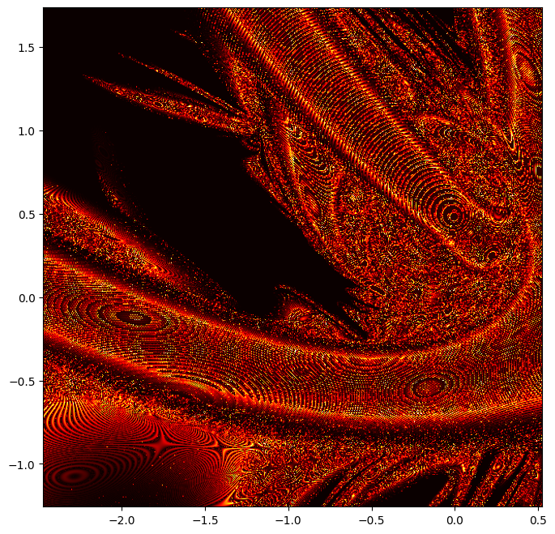

# pncg-caos
e se

Rodei um grid com 40 mil pontos no entorno do primeiro corpo, num quadrado de lado 1 e com espaços de 0.005. A simulação, os cálculos estatísticos e a geração de imagem levaram ao todo cerca de 2 horas para ficar prontos. Foram gerados 20.1 MB de valores iniciais, 9.15 GB das trajetórias das 40 mil simulações, 36.6 MB de dados de métrica e 6.82 MB de imagens. Um vídeo compilando todas as imagens foi gerado também.

